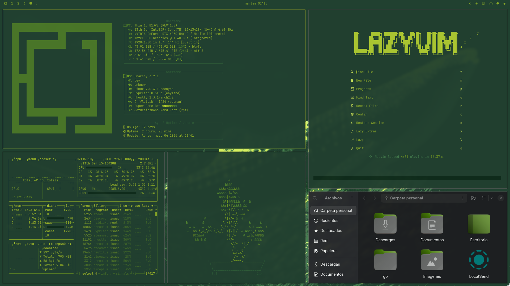

# Super Game Bro - Omarchy Theme

A monochromatic Game Boy DMG-inspired theme for Omarchy on Arch Linux / Hyprland.

Built around a verified green palette with 8 luminance stops — from near-black `#0D2A1A`
to lime `#D4F060` — ensuring contrast between every syntax element, UI component, and mode indicator.

## Palette

| Role | Hex | Use |
|---|---|---|
| Background | `#214130` | Editor, terminal |
| Foreground | `#88A827` | Normal text |
| Accent / Selected | `#B8D432` | Walker selection, keywords |
| Bright lime | `#D4F060` | Constants, active search |

## Includes

- `colors.toml` — Ghostty terminal colors
- `neovim.lua` — Custom colorscheme via `nvim_set_hl`, no external dependencies. Full Treesitter + LSP semantic token coverage. Lualine theme with per-mode colors.
- `btop.theme` — Full gradient mapping
- `waybar.css` — Omarchy template variables
- `icons.theme` — Yaru-prussiangreen-dark
- `backgrounds/` — Pixel art wallpapers (Omarchy logo, CachyOS logo, Game Boy)

## Install

```bash
omarchy-theme-install https://github.com/isaac30503/omarchy-super-game-bro-theme
```

## Preview


